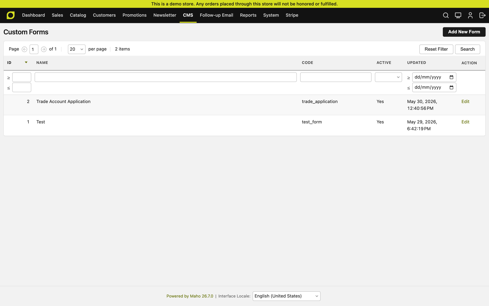
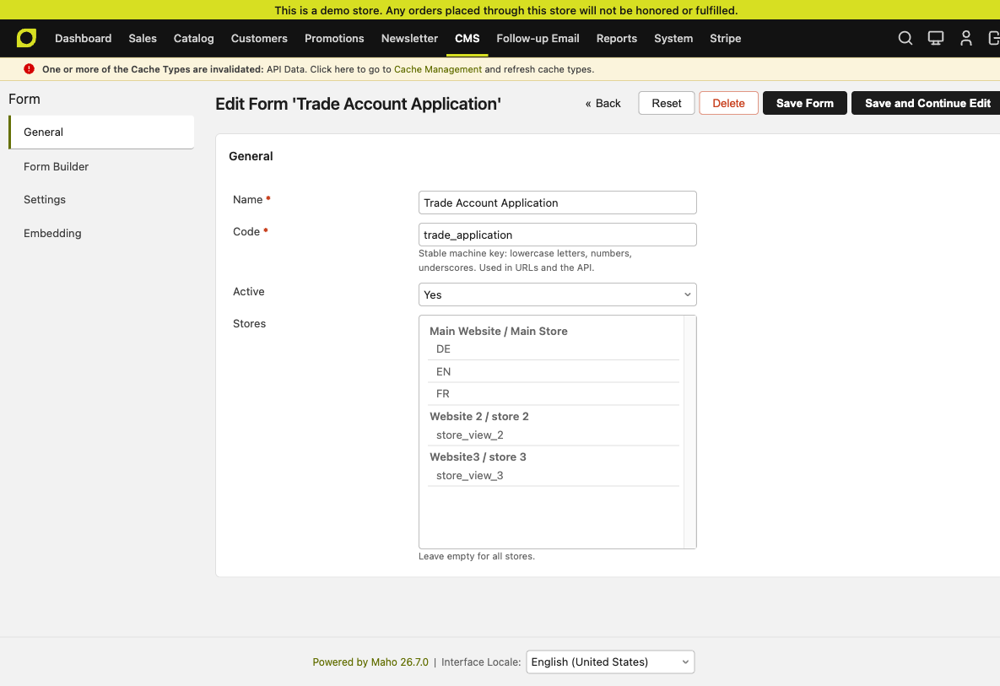
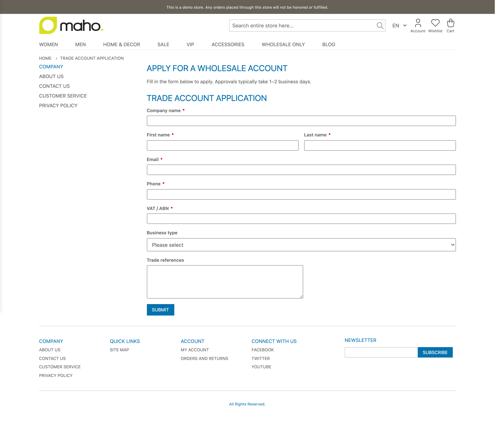
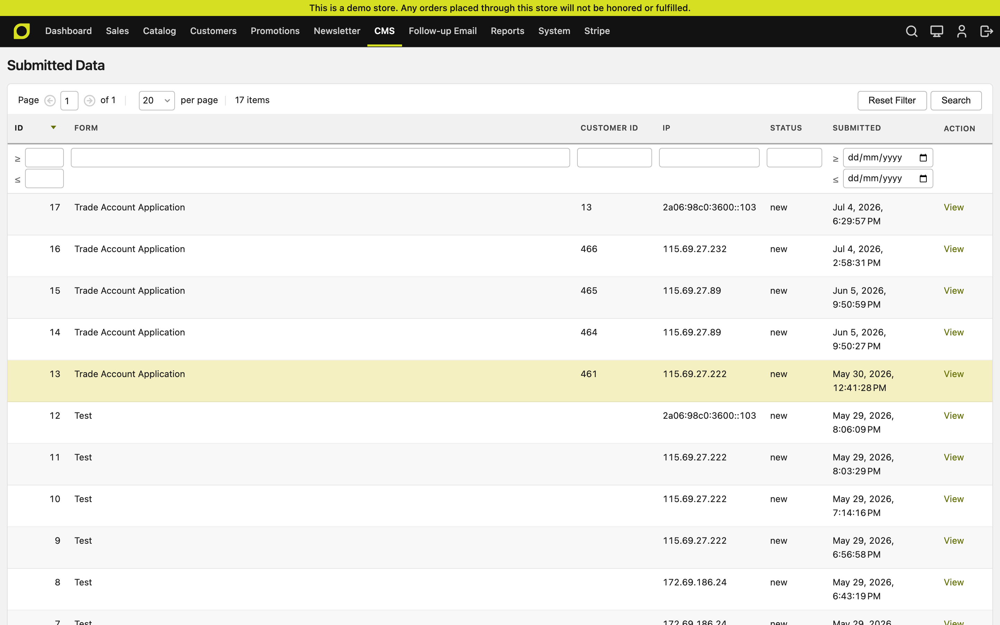

# MageAustralia_CustomForms

Schema-first form builder for Maho 26.5+. Build forms in an admin drag-style
builder, render them on the storefront via a layout block, and collect
submissions with spam protection, email notifications, and a review grid.

## Features

- **Admin form builder** - fields, types, validation, layout, conditional
  logic, and multi-step support, stored as a single JSON schema per form
- **Submissions grid** - review, filter, and export what customers sent;
  payloads stored as JSON keyed by field
- **Per-form settings** - captcha on/off, notification recipients, success
  message / redirect behaviour
- **Store scoping** - limit a form to specific store views
- **Stable form codes** - forms are referenced by machine key, so other
  modules can consume them (the MageAustralia B2B suite's trade-application
  flow is built on this module)
- **CSRF-protected POST endpoint** at `/customforms/form/submit` with IP
  logging

## Screenshots

**Forms grid and schema editing in the admin:**

| Manage forms | Form schema |
|---|---|
|  |  |

**Storefront render + submissions review:**

| Rendered form | Submissions |
|---|---|
|  |  |

## Requirements

- Maho 26.5+ (tested on 26.7)
- PHP 8.3+

## Installation

Installed from GitHub (not on Packagist):

```bash
composer config repositories.maho-module-custom-forms vcs https://github.com/mageaustralia/maho-module-custom-forms
composer require mageaustralia/maho-module-custom-forms
```

Then from your Maho root:

```bash
composer dump-autoload
./maho migrate
./maho cache:flush
```

## Usage

1. Create a form under the CustomForms admin menu; give it a stable **code**.
2. Render it on the storefront with a layout block referencing that code, or
   consume it from another module (e.g. a registration flow) by code.
3. Submissions arrive in the admin grid; notification emails go to the
   addresses configured per form.

## Part of the MageAustralia B2B suite

Pairs with [maho-module-b2b-registration](https://github.com/mageaustralia/maho-module-b2b-registration)
(trade-account applications built on CustomForms) and
[maho-module-b2b-access](https://github.com/mageaustralia/maho-module-b2b-access)
(storefront gating). The commercial **B2B Pro** tier adds quoting, company
accounts, order approvals, and net-terms payment - contact us for access.

## License

OSL-3.0
